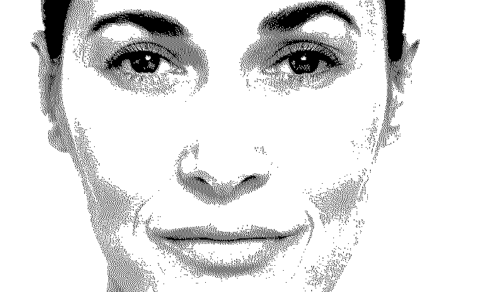
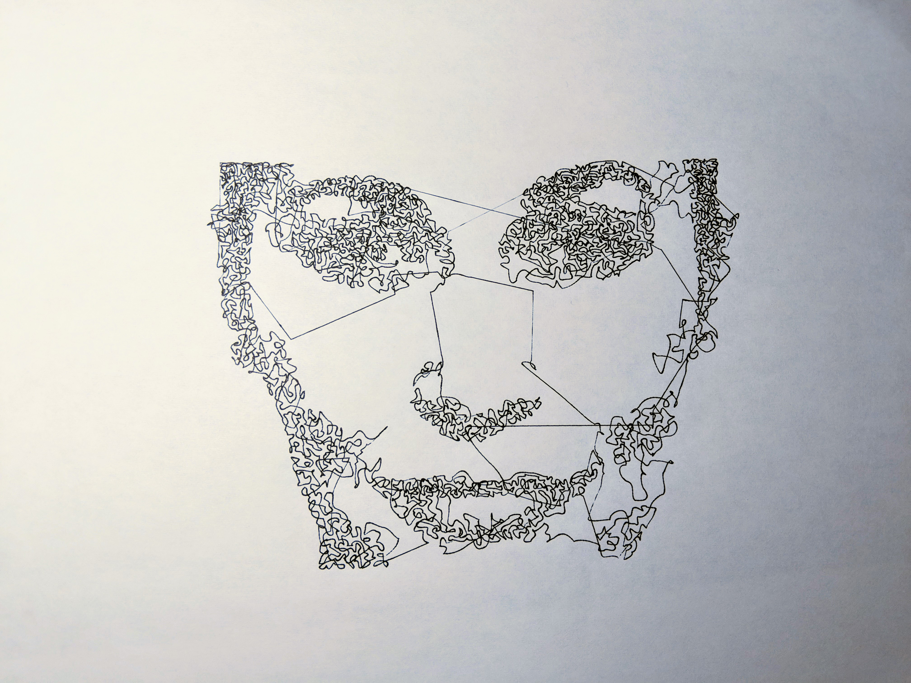
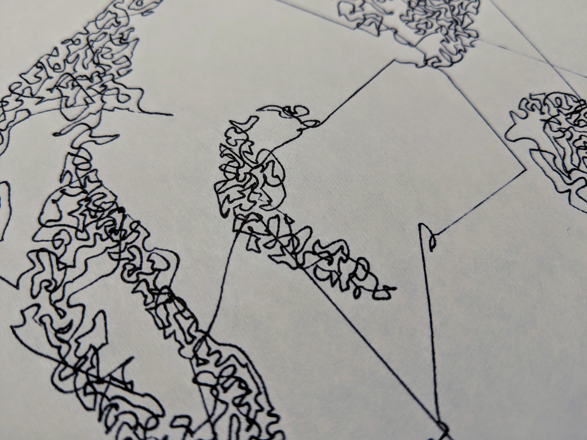

# StringyPlotter

## What is this?

This program produces a single continuous line from a black and white bitmap image suitable for use with pen plotters.

I saw some pretty neat images made with plotters like the [AxiDraw](https://axidraw.com/) and wanted to do something like it. While I didn't produce something quite like my inpiration, it is pretty okay for one night of hacking. 

## How does it work?

First, you need a black and white bitmap image. I used [Gimp](https://www.gimp.org/) to change the mode to an indexed 1-bit palette, and selected the Floyd-Steinberg (reduced color bleeding) dithering option. It probably works best with high contrast images, but you tell me.

Next, when running the program it performs the following transformations:

* Convert the image to a NumPy array
* Find the coordinates of all of the black (1) pixels
* Take a random sample according to some divisor of the total number of pixels
* Then starting with the first pixel, draw a line to the next nearest pixel

This takes a minute or so on my old computer and due to the sequential nature of how I threw it together isn't the fastest thing anyway. I then loaded this into [Inkscape](https://inkscape.org/) and did a single pass of the Simplify (Ctrl+L) option on the path, did some centering, and then exported it to HPGL to be sent to the plotter.

## How could I make it work?

With Python 3, make sure you have Pillow, NumPy, and SciPy installed. Then:

	python3 ./StringyPlotter.py input_image.png output_image.svg 2

The number on the end is how much you want to divide the total number of black pixels in the image to obtain a sample size. The value of 2 means that we'll use half of the black pixels at random to connect our lines. You will probably want to play with this number according to your patience or image size.

## What does it look like?

### Input image

### Black and white dithered 1-bit image from Gimp

### Output SVG

### Simplified SVG

### Plotter Output

## Inspiration

* https://twitter.com/Spongenuity/status/1047984424183386112
* https://github.com/evil-mad/axidraw/blob/master/examples/less%20basic%20demos/Woolf.svg
* https://www.evilmadscientist.com/forums/topic/virgina-woolf-drawing-strategy/
* https://fronkonstin.com/2017/03/07/frankenstein/
* https://twitter.com/scruss/status/1048028336340062208
* https://twitter.com/paulrickards/status/1042587368707039233

## License

GPLv3

